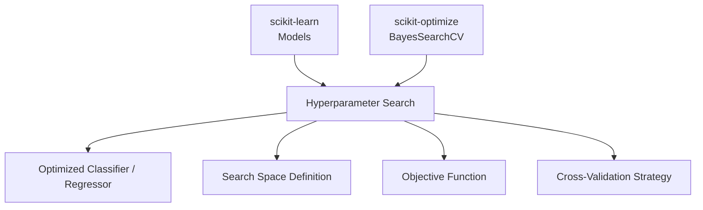

# 📘 Chapter 2 — Hyperparameter Optimization with scikit-optimize (skopt)

*This chapter introduces Bayesian Optimization using scikit-optimize and shows how it improves machine learning model performance beyond manual tuning or grid search.*

---

## 1. Chapter Goals

After completing this chapter, you will be able to:

* Understand the motivation for hyperparameter optimization
* Compare Grid Search, Random Search, and Bayesian Optimization
* Use **scikit-optimize** (`skopt`) and `BayesSearchCV` to tune model hyperparameters
* Build an optimized classification model with improved accuracy
* Apply search spaces, search strategies, and advanced tuning techniques

This chapter is self-contained.
If you complete only this chapter, you will still have a fully working ML + hyperparameter optimization pipeline.

---

## 2. What is Hyperparameter Optimization?

Most ML models contain **hyperparameters** that significantly influence performance, such as:

* SVM: `C`, `gamma`, `kernel`
* RandomForest: `n_estimators`, `max_depth`
* LogisticRegression: `penalty`, `C`
* KNN: `n_neighbors`

Choosing these manually is time-consuming and often suboptimal.

Hyperparameter optimization seeks to:

> **Find the best hyperparameters that maximize model performance on validation data.**

---

## 3. Why Bayesian Optimization?

There are three common strategies:

| Method                            | How it Works                | Pros                  | Cons                     |
| --------------------------------- | --------------------------- | --------------------- | ------------------------ |
| **Grid Search**                   | Try all combinations        | Simple                | Very slow, scales poorly |
| **Random Search**                 | Try random combos           | Faster                | Still inefficient        |
| **Bayesian Optimization (skopt)** | Learns where to search next | Fastest, best results | Slightly more complex    |

Bayesian Optimization uses a surrogate model (e.g., Gaussian Process or Tree-based Surrogate) to **predict which hyperparameters are promising** and evaluate them first.

This leads to higher accuracy with fewer evaluations.

---

## 4. Relationship Map: scikit-learn + scikit-optimize



---

## 5. Installation

```
pip install scikit-optimize
```

Check installation:

```python
import skopt
print(skopt.__version__)
```

---

## 6. Minimal Working Example: Bayesian Optimization with SVM

Save this as:

```
02_hyperparam_search.ipynb
```

This example tunes an SVM classifier on the Iris dataset.

---

### **Bayesian Optimization Example**

```python
# ============================================================
# Hyperparameter Optimization with scikit-optimize
# ============================================================

from sklearn.datasets import load_iris
from sklearn.model_selection import train_test_split
from sklearn.preprocessing import StandardScaler
from sklearn.svm import SVC
from sklearn.metrics import accuracy_score
from skopt import BayesSearchCV
from skopt.space import Real, Categorical, Integer

# ------------------------------------------------------------
# 1. Load dataset
# ------------------------------------------------------------
X, y = load_iris(return_X_y=True)

X_train, X_test, y_train, y_test = train_test_split(
    X, y, test_size=0.2, random_state=42, stratify=y
)

# ------------------------------------------------------------
# 2. Preprocessing
# ------------------------------------------------------------
scaler = StandardScaler()
X_train_std = scaler.fit_transform(X_train)
X_test_std = scaler.transform(X_test)

# ------------------------------------------------------------
# 3. Define search space for SVM
# ------------------------------------------------------------
search_spaces = {
    "C": Real(1e-3, 1e3, prior="log-uniform"),
    "gamma": Real(1e-4, 1e1, prior="log-uniform"),
    "kernel": Categorical(["rbf", "poly"]),
    "degree": Integer(2, 5)
}

# ------------------------------------------------------------
# 4. Bayesian Optimization with BayesSearchCV
# ------------------------------------------------------------
opt = BayesSearchCV(
    estimator=SVC(),
    search_spaces=search_spaces,
    n_iter=32,               # number of evaluations
    cv=3,                    # 3-fold cross-validation
    scoring="accuracy",
    n_jobs=-1,
    random_state=42
)

opt.fit(X_train_std, y_train)

print("Best parameters found:")
print(opt.best_params_)

# ------------------------------------------------------------
# 5. Evaluate optimized model
# ------------------------------------------------------------
y_pred = opt.predict(X_test_std)
acc = accuracy_score(y_test, y_pred)

print("\nOptimized Test Accuracy:", acc)
```

---

## 7. Understanding the Search Space

Search spaces define **how the optimizer explores hyperparameters**.

### Types:

#### 🔹 **Real**

Continuous ranges
Used for learning rate, C, gamma, etc.

```python
Real(1e-3, 1e3, prior="log-uniform")
```

#### 🔹 **Integer**

Discrete integers
Used for number of layers, depth, etc.

```python
Integer(1, 10)
```

#### 🔹 **Categorical**

Non-numeric options

```python
Categorical(["rbf", "linear", "poly"])
```

---

## 8. Why Bayesian Optimization Works Better

Instead of randomly sampling hyperparameters, it:

1. Builds a **surrogate model** of the objective function
2. Chooses next hyperparameters using **Expected Improvement**
3. Evaluates model
4. Updates surrogate
5. Repeats until best solution found

This is ideal for expensive models or limited compute.

---

## 9. Practical Tips for Good Optimization

### ✔ Scale your input features

SVM, KNN, Logistic Regression benefit from standardization.

### ✔ Use log-uniform for wide ranges

Models like SVM require exponential ranges.

### ✔ Keep `cv=3` or `cv=5`

More folds → more reliable, but slower.

### ✔ Increase `n_iter` for harder tasks

Typical values:

* easy datasets: 16–32
* medium datasets: 50–100
* large datasets: 200+ (GPU/parallel recommended)

---

## 10. Exercises (Optional)

### **Exercise 1 — Optimize a RandomForest**

Try this search space:

```python
search_spaces = {
    "n_estimators": Integer(50, 300),
    "max_depth": Integer(2, 20),
    "max_features": Categorical(["auto", "sqrt", "log2"]),
}
```

---

### **Exercise 2 — Compare with GridSearchCV**

Measure:

* runtime
* accuracy
* number of model evaluations

Bayesian optimization should win.

---

### **Exercise 3 — Add early stopping**

Use `n_iter=50` and observe diminishing returns after ~20 iterations.

---

### **Exercise 4 — Log experiment metrics**

Save best params and accuracy as JSON.

---

### **Exercise 5 — Visualize optimization history**

Use:

```python
opt.cv_results_["mean_test_score"]
```

Plot score vs iteration.

---

## 11. Next Chapter

If you want to continue:

### 👉 **Chapter 3 — Image Processing with scikit-image + scikit-learn**

In Chapter 3, you will:

* Load and process images
* Extract features using scikit-image
* Train classical ML models (SVM, KNN, RandomForest) on image features
* Build a complete image classification mini-pipeline

---
