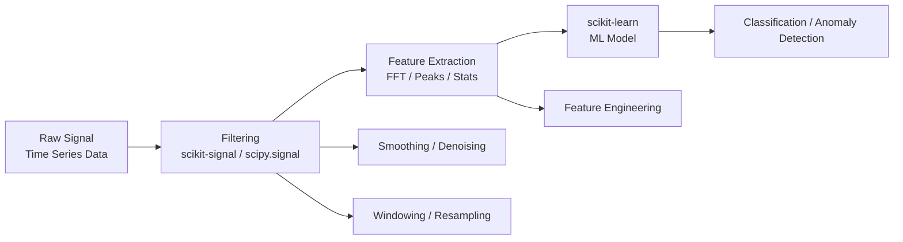

# 📘 Chapter 4 — Signal & Time-Series Processing with scikit-signal + scikit-learn

*A practical introduction to processing, filtering, and analyzing signals for ML tasks.*

---

## 1. Chapter Goals

After completing this chapter, you will be able to:

* Understand how signal-processing libraries fit into the scikit ecosystem
* Apply essential time-series operations:

  * filtering (low-pass, high-pass)
  * smoothing
  * spectral analysis (FFT)
* Extract features from time-series
* Use scikit-learn for classification or anomaly detection
* Build a **complete pipeline**:
  *raw signal → preprocessing → feature extraction → ML model*

This chapter is **self-contained**. No prior knowledge of DSP is required.

---

## 2. Relationship Map: scikit-signal / SciPy + scikit-learn



### Interpretation

* **Signal library** handles signal operations
* **scikit-learn** handles ML / clustering / anomaly detection

---

## 3. Why Signal Processing Matters in ML?

Many real-world ML problems involve time-series:

* energy consumption
* vibration data
* audio signals
* ECG / medical signals
* sensor data from IoT
* chilled water / HVAC systems (like your energy analytics project)

Signal preprocessing often dramatically improves ML performance:

> Clean signals → reliable features → better classifiers.

---

## 4. Installation

### scikit-signal (optional, community package)

```
pip install scikit-signal
```

### SciPy (recommended baseline)

```
pip install scipy
```

### ML toolkit

```
pip install scikit-learn matplotlib numpy
```

---

## 5. Minimal Working Example: Filtering + Feature Extraction + Anomaly Detection

This example uses:

* a synthetic noisy sine wave
* filtering (low-pass)
* feature extraction
* IsolationForest for anomaly detection

Save as:

```
04_signal_filter_and_clf.ipynb
```

---

### **Complete Example (Fully Runnable)**

```python
# ============================================================
# Signal Processing + ML with SciPy and scikit-learn
# ============================================================

import numpy as np
import matplotlib.pyplot as plt
from scipy.signal import butter, filtfilt
from scipy.fft import fft, fftfreq
from sklearn.ensemble import IsolationForest

# ------------------------------------------------------------
# 1. Generate Synthetic Signal
# ------------------------------------------------------------
np.random.seed(42)
t = np.linspace(0, 5, 1000)
signal = np.sin(2 * np.pi * 3 * t)              # 3 Hz sine wave
noise = 0.5 * np.random.randn(len(t))           # Gaussian noise
raw = signal + noise

# Inject anomalies
raw[200:210] += 4
raw[700:710] -= 4

# ------------------------------------------------------------
# 2. Apply Low-Pass Filter
# ------------------------------------------------------------
def butter_lowpass_filter(data, cutoff, fs, order=4):
    nyq = 0.5 * fs
    norm_cutoff = cutoff / nyq
    b, a = butter(order, norm_cutoff, btype="low", analog=False)
    return filtfilt(b, a, data)

fs = 200                      # sample rate
filtered = butter_lowpass_filter(raw, cutoff=10, fs=fs)

# ------------------------------------------------------------
# 3. FFT: Spectral Analysis
# ------------------------------------------------------------
freqs = fftfreq(len(t), 1/fs)
fft_values = np.abs(fft(filtered))

# Extract dominant frequency as a feature
dominant_freq = freqs[np.argmax(fft_values)]

# ------------------------------------------------------------
# 4. Feature Engineering
# ------------------------------------------------------------
# Window-based statistical features
window = 50
features = []
for i in range(len(filtered) - window):
    segment = filtered[i:i+window]
    features.append([
        np.mean(segment),
        np.std(segment),
        np.max(segment) - np.min(segment),
    ])

features = np.array(features)

# ------------------------------------------------------------
# 5. Anomaly Detection with IsolationForest
# ------------------------------------------------------------
model = IsolationForest(contamination=0.05, random_state=42)
labels = model.fit_predict(features)

# Convert labels to anomaly indices
anomaly_indices = np.where(labels == -1)[0]

# ------------------------------------------------------------
# 6. Plot Results
# ------------------------------------------------------------
plt.figure(figsize=(12, 5))
plt.plot(raw, alpha=0.4, label="Raw Signal")
plt.plot(filtered, label="Filtered Signal", linewidth=2)
plt.scatter(anomaly_indices, filtered[anomaly_indices], 
            color="red", label="Detected Anomalies")
plt.title("Signal Processing + Anomaly Detection")
plt.legend()
plt.show()

print("Dominant frequency:", dominant_freq)
```

---

## 6. Explanation of the Workflow

### **Step 1 — Generate / Load Time-Series**

You may replace synthetic signal with actual sensor data (CSV, IoT logs, HVAC data).

### **Step 2 — Filtering**

We use a **Butterworth low-pass filter**:

* removes high-frequency noise
* preserves overall signal structure

Filtering is essential before feature extraction.

### **Step 3 — FFT (Fast Fourier Transform)**

Converts the signal into the frequency domain.

Useful features:

* dominant frequency
* total power
* spectral centroid
* high-frequency energy

### **Step 4 — Rolling Window Features**

From each window, extract:

* mean
* standard deviation
* amplitude (max − min)

You can add:

* skewness
* kurtosis
* energy
* entropy

### **Step 5 — IsolationForest**

Perfect for anomaly detection in energy or sensor systems.

Output:

* `+1` normal
* `-1` anomaly

### **Step 6 — Visualization**

Plot raw signal + filtered signal + anomalies.

---

## 7. Useful Functions (Cheat Sheet)

### **Low-pass filter**

```python
from scipy.signal import butter, filtfilt
```

### **High-pass filter**

```python
butter(order, cutoff/nyq, btype="high")
```

### **Smoothing (simple moving average)**

```python
np.convolve(data, np.ones(10)/10, mode="same")
```

### **Derivative features**

```python
np.diff(signal)
```

### **Peak detection**

```python
from scipy.signal import find_peaks
peaks, _ = find_peaks(filtered, height=1.5)
```

### **Resampling**

```python
from scipy.signal import resample
new_signal = resample(raw, 500)
```

---

## 8. Exercises (Optional)

### **Exercise 1 — Add a high-pass filter**

Remove low-frequency drift.

### **Exercise 2 — Use HHT / STFT**

Try:

* Hilbert-Huang Transform
* Short-Time Fourier Transform

### **Exercise 3 — Add more features**

Try:

* energy
* spectral entropy
* rolling variance
* zero-crossing rate

### **Exercise 4 — Train a classifier**

Instead of anomalies, label your own windows as:

* “normal cooling cycle”
* “faulty cycle”

Use:

```python
from sklearn.ensemble import RandomForestClassifier
```

### **Exercise 5 — Compare with DBSCAN**

Cluster windows based on their features.

---

## 9. Real-World Applications

This pipeline is commonly used in:

| Field             | Example                                 |
| ----------------- | --------------------------------------- |
| Energy Analytics  | chilled water anomalies, pump vibration |
| Structural Health | crack detection, resonance monitoring   |
| Healthcare        | ECG, EEG signal classification          |
| Manufacturing     | sensor failure detection                |
| IoT Systems       | multi-sensor fusion                     |
| Audio             | keyword spotting, noise detection       |

For your own research (energy analytics), this chapter maps well to:

* **cluster-based anomaly detection**
* **feature engineering from HVAC/chilled water time-series**
* **preprocessing before ML modeling**

---

## 10. Next Chapter

If you're ready, move on to:

### 👉 **Chapter 5 — Domain-Specific scikit Extensions (Bio, Geo, Physics)**

This includes:

* scikit-bio (biology, genomics)
* scikit-gstat (geostatistics, kriging)
* scikit-hep (high-energy physics)
* scikit-fem (finite element modeling)

These domain libraries extend the scikit ecosystem beyond standard ML.

---
